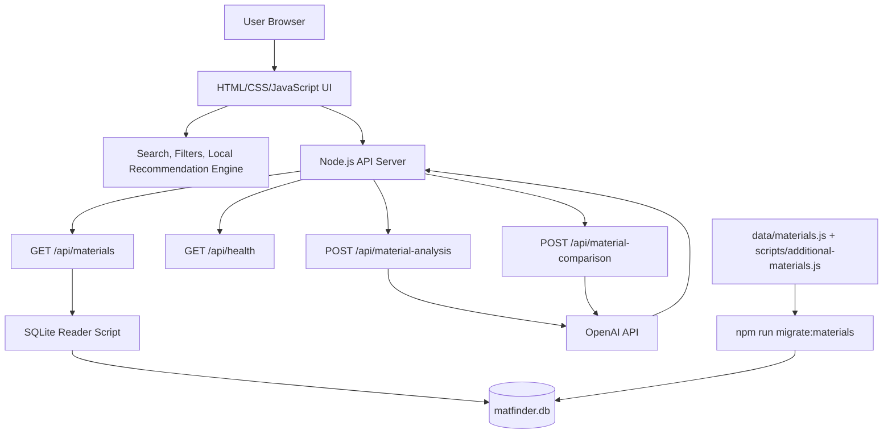

# MatFinder AI

MatFinder AI is an AI-assisted polymer material recommendation platform. It combines a local, source-tracked SQLite material database with a browser-based search and filtering interface, a local requirement-matching recommendation engine, and optional OpenAI-powered explanations for material analysis and comparison.

The system is designed to keep the local material database as the source of truth. GPT is used only to explain and compare the material profiles already stored in MatFinder AI; it is not used to invent material properties or replace the curated database.

## Key Features

- Material search by name, abbreviation, category, tags, properties, and typical uses.
- Multi-condition filtering for category, performance focus, continuous use temperature, tensile strength, and recyclability.
- Local recommendation engine that ranks materials from natural language requirement descriptions.
- SQLite material database with normalized tables for materials, tags, uses, and sources.
- Source tracking for material records, including source title, URL, source type, and notes.
- AI material analysis panel for selected materials, powered by the OpenAI API when configured.
- AI material comparison panel for two selected materials, while preserving the existing comparison table.
- Bilingual UI with Chinese as the default language and English as an alternate language.
- Docker-ready deployment with health checks and platform configuration for Render, Railway, and Vercel frontend hosting.

## Tech Stack

- HTML, CSS, and JavaScript for the frontend.
- Node.js built-in HTTP server for static assets and API routes.
- SQLite for the local material database.
- Python `sqlite3` scripts for database generation and reads.
- OpenAI API for optional material explanations and comparison narratives.
- Docker for production packaging and deployment.

## Architecture



## Project Structure

```txt
.
|-- index.html
|-- styles.css
|-- app.js
|-- recommendation-engine.js
|-- config.js
|-- server.js
|-- matfinder.db
|-- data/
|   `-- materials.js
|-- scripts/
|   |-- additional-materials.js
|   |-- build-frontend-config.js
|   |-- migrate-materials-to-sqlite.js
|   |-- read-materials-sqlite.py
|   |-- smoke-openai-analysis.js
|   |-- start-production.js
|   `-- write-materials-sqlite.py
|-- Dockerfile
|-- render.yaml
|-- railway.json
|-- vercel.json
`-- DEPLOYMENT.md
```

## Local Setup

### Prerequisites

- Node.js 20 or newer.
- Python 3 with the standard `sqlite3` module.
- Optional: an OpenAI API key for AI analysis and comparison.

### Install and Run

```bash
npm install
npm run migrate:materials
npm start
```

Open the app:

```txt
http://localhost:3000
```

Check server health:

```txt
http://localhost:3000/api/health
```

### Environment Variables

Create `.env.local` for local development. Do not commit real secrets.

```bash
cp .env.example .env.local
```

Common variables:

| Variable | Purpose |
| --- | --- |
| `PORT` | Local or platform HTTP port. Defaults to `3000`. |
| `NODE_ENV` | Use `production` for production deployments. |
| `MATFINDER_DB_PATH` | SQLite database path. Defaults to `matfinder.db`. |
| `OPENAI_API_KEY` | Enables AI material analysis and comparison. |
| `OPENAI_MODEL` | OpenAI model name. Defaults to `gpt-4.1-mini`. |
| `MATFINDER_ALLOWED_ORIGINS` | Comma-separated CORS allowlist for separate frontend deployments. |
| `MATFINDER_API_BASE_URL` | Frontend API origin used when hosting the frontend separately. |

Without `OPENAI_API_KEY`, the local database, search, filters, local recommendation engine, material details, and comparison table continue to work.

## Database Workflow

MatFinder AI uses SQLite in production and development. The migration command builds `matfinder.db` from the checked-in material source files.

```bash
npm run migrate:materials
```

The database includes:

- `materials`
- `material_tags`
- `material_uses`
- `material_sources`

The frontend-facing API keeps the existing material array format:

```txt
GET /api/materials
```

## AI Behavior

AI features are optional and require `OPENAI_API_KEY`.

- `POST /api/material-analysis` sends one selected material profile to GPT.
- `POST /api/material-comparison` sends two selected material profiles to GPT.
- The prompt instructs GPT to explain only from the supplied local database fields.
- The local SQLite database remains the source of truth for material properties.

## Deployment

See [DEPLOYMENT.md](DEPLOYMENT.md) for the full deployment guide.

### Docker

```bash
docker build -t matfinder-ai .
docker run --rm -p 3000:3000 --env-file .env.local matfinder-ai
```

The Docker image installs Python 3, rebuilds `matfinder.db`, serves the frontend and APIs from Node.js, and exposes `/api/health`.

### Render

- Deploy as a Docker Web Service.
- Use the included `render.yaml` or configure the service manually.
- Set health check path to `/api/health`.
- Configure `OPENAI_API_KEY` if AI panels should be enabled.

### Railway

- Deploy from the repository.
- Railway uses the included `Dockerfile` and `railway.json`.
- Configure environment variables in the Railway project settings.
- Verify the public service with `/api/health`.

### Vercel Frontend

Vercel is recommended for static frontend hosting only. Deploy the backend to Render or Railway first.

- Set `MATFINDER_API_BASE_URL` to the backend URL.
- Use `npm run build:frontend-config` as the build command.
- Use `.` as the output directory.
- Add the Vercel origin to the backend `MATFINDER_ALLOWED_ORIGINS` value.

## Quality Checks

Recommended checks before deployment:

```bash
node --check server.js
node --check app.js
node --check recommendation-engine.js
npm run migrate:materials
npm start
```

Optional OpenAI smoke test:

```bash
npm run smoke:openai
```

## Roadmap

- Add an admin workflow for reviewing and editing material records.
- Add source visibility in the material detail panel.
- Add grade-level material records with clearer property ranges and uncertainty metadata.
- Add export options for recommendations and comparisons.
- Add vector or embedding-based requirement matching while keeping local SQLite as the source of truth.
- Add automated data validation checks for numeric ranges, missing sources, and duplicate materials.
- Add user-selectable OpenAI model settings for deployed environments.
- Add persistent storage support for future write-enabled deployments.

## License

No license has been specified yet. Add a license before distributing or deploying publicly.
