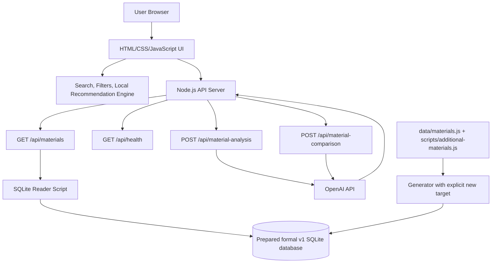

# MatFinder AI

MatFinder AI is an AI-assisted polymer material recommendation platform. It combines a local, source-tracked SQLite material database with a browser-based search and filtering interface, a local requirement-matching recommendation engine, and optional OpenAI-powered explanations for material analysis and comparison.

The system is designed to keep the local material database as the source of truth. GPT is used only to explain and compare the material profiles already stored in MatFinder AI; it is not used to invent material properties or replace the curated database.

## Key Features

- Material search by name, abbreviation, category, tags, properties, and typical uses.
- Multi-condition filtering for category, performance focus, continuous use temperature, tensile strength, and recyclability.
- Local recommendation engine that ranks materials from natural language requirement descriptions.
- Focused primary workflow: requirement input, material recommendation, material explanation, and PDF report export.
- Multi-page application structure with Home, Materials Database, Compare, contextual AI Copilot, and About pages.
- SQLite material database with normalized tables for materials, tags, uses, and sources.
- Source tracking for material records, including source title, URL, source type, and notes.
- AI material analysis panel for selected materials, powered by the OpenAI API when configured.
- AI material comparison panel for two selected materials, while preserving the existing comparison table.
- Material Selection Report export workflow using a clean print-to-PDF report page.
- Bilingual UI with Chinese as the default language and English as an alternate language.
- Deployment configuration and health checks for Render, Railway, and Vercel frontend hosting; AD-09 production image preparation is pending Phase 3.

## Site Structure

MatFinder AI is served as a lightweight multi-page app with client-side routing and server fallback to `index.html` for clean URLs.

| Route | Page | Purpose |
| --- | --- | --- |
| `/` | Home | Primary material-selection workflow with requirement input, recommendations, material explanation, and report export. |
| `/materials` | Materials Database | Browse all materials, search, filter by category/performance, and view the total material count. |
| `/compare` | Compare | First-class shortlist workflow for selecting up to 3 materials and reviewing a side-by-side property table plus optional AI comparison. |
| `/copilot` | AI Copilot | Contextual assistant for follow-up questions after a material has been opened from recommendations or the database. |
| `/about` | About | End-user explanation of the dataset, scoring model, and validation expectations before final selection. |

## Tech Stack

- HTML, CSS, and JavaScript for the frontend.
- Node.js built-in HTTP server for static assets and API routes.
- SQLite for the local material database.
- OpenAI API for optional material explanations and comparison narratives.
- Docker for production packaging and deployment.

## Architecture


```mermaid
flowchart TD
  User["User Browser"] --> UI["HTML/CSS/JavaScript UI"]
  UI --> Search["Search, Filters, Local Recommendation Engine"]
  UI --> API["Node.js API Server"]

  API --> Materials["GET /api/materials"]
  API --> Health["GET /api/health"]
  API --> Analysis["POST /api/material-analysis"]
  API --> Comparison["POST /api/material-comparison"]

  Materials --> Reader["SQLite Reader Script"]
  Reader --> DB[("Prepared formal v1 SQLite database")]

  Analysis --> OpenAI["OpenAI API"]
  Comparison --> OpenAI
  OpenAI --> API

  SourceData["data/materials.js + scripts/additional-materials.js"] --> Migration["Generator with explicit new target"]
  Migration --> DB
```

## Project Structure

```txt
.
|-- public/
|   |-- index.html
|   |-- styles.css
|   |-- app.js
|   |-- recommendation-engine.js
|   |-- config.js
|   `-- assets/
|-- server.js
|-- matfinder.db
|-- data/
|   `-- materials.js
|-- scripts/
|   |-- additional-materials.js
|   |-- build-frontend-config.js
|   |-- migrate-materials-to-sqlite.js
|   |-- read-materials-sqlite.py
|   |-- smoke-openai-analysis.js
|   |-- start-production.js
|   `-- write-materials-sqlite.py
|-- Dockerfile
|-- render.yaml
|-- railway.json
|-- vercel.json
`-- DEPLOYMENT.md
```

## Local Setup

### Prerequisites

- Node.js 22.13 or newer, below 25 (the range in `package.json`).
- Python 3 with the standard-library `sqlite3` module for offline database preparation and generation.
- Optional: an OpenAI API key for AI analysis and comparison.

### Install and Run

```bash
npm install
```

The checked-in `matfinder.db` is an unprepared `legacy_current` v0 source database.
Runtime accepts formal v1 only. Keep the tracked source unchanged and prepare a
separate local copy before starting the application.

Replace `<local-db-copy>` with an absolute path outside the checkout that does
not already exist; its parent directory must exist. Choose the block for your
shell, run it from the project root, and continue to startup only after `prepare`
exits 0.

POSIX shell:

```bash
local_db="<local-db-copy>"
cp ./matfinder.db "$local_db"
npm run migrate -- inspect --database "$local_db"
npm run migrate -- prepare --database "$local_db"
MATFINDER_DB_PATH="$local_db" npm start
```

PowerShell:

```powershell
$db = "<local-db-copy>"
Copy-Item -LiteralPath ./matfinder.db -Destination $db
npm run migrate -- inspect --database "$db"
npm run migrate -- prepare --database "$db"
$env:MATFINDER_DB_PATH = $db
npm start
```

On Windows, use `npm.cmd` in these commands if execution policy blocks `npm.ps1`.
Without a `MATFINDER_DB_PATH` override, `npm start` selects the tracked v0 database
and intentionally exits 1 with `SCHEMA_OFFLINE_PREPARATION` before listening.
Supply the prepared copy; the web process does not migrate the database or use a
v0 fallback.

Open the app:

```txt
http://localhost:3000
```

Check server health:

```txt
http://localhost:3000/api/health
```

Schema-compatible startup should return `{"status":"ok"}` from `/api/health`.
This does not establish catalog readiness: a local copy without matching AD-08
catalog-stats can still return 503 from `/api/ready`.

### Environment Variables

Create `.env.local` for local development. Do not commit real secrets.

```bash
cp .env.example .env.local
```

Common variables:

| Variable | Purpose |
| --- | --- |
| `PORT` | Local or platform HTTP port. Defaults to `3000`. |
| `NODE_ENV` | Use `production` for production deployments. |
| `MATFINDER_DB_PATH` | Prepared formal-v1 SQLite database path. Defaults to the tracked `matfinder.db`, which currently requires offline preparation of a separate copy. |
| `OPENAI_API_KEY` | Enables AI material analysis and comparison. |
| `OPENAI_MODEL` | OpenAI model name. Defaults to `gpt-4.1-mini`. |
| `MATFINDER_ALLOWED_ORIGINS` | Comma-separated CORS allowlist for separate frontend deployments. |
| `MATFINDER_API_BASE_URL` | Frontend API origin used when hosting the frontend separately. |

With a compatible database, the local database, search, filters, local recommendation engine, material details, and comparison table work without `OPENAI_API_KEY`.

## Database Workflow

### Canonical offline lifecycle

The JSON schema contract and canonical lifecycle runner are the schema mutation
authority. Runtime opens the selected database read-only and accepts formal v1.
Use the local-copy workflow above rather than preparing the tracked source.

```bash
npm run migrate -- inspect --database "<database-path>"
npm run migrate -- prepare --database "<local-db-copy>"
npm run migrate -- bootstrap --database "<new-empty-db>"
```

- `inspect` classifies and validates an existing database without changing it. It exits 0 for recognized blank, legacy-current v0, or formal-v1 inputs, and 1 for unsupported, drifted, future-version, or unreadable inputs.
- `prepare` works offline on an existing local copy. It applies a supported transition to formal v1, or returns `already_current` for a compatible v1 database; success exits 0. It rejects arbitrary old, drifted, or future databases with exit 1 rather than repairing or simply stamping them.
- `bootstrap` requires a new, absent path and creates an empty formal-v1 database. Material population is a separate step.

### Generate a new material database

To populate a new disposable database from the checked-in material source files,
provide one explicit positional target; no output flag is supported:

```bash
npm run migrate:materials -- "<new-generated-db>"
npm run migrate -- inspect --database "<new-generated-db>"
```

Choose a new path outside the checkout with an existing parent directory. The
generator exits 1 when the target is omitted or already exists, including the
tracked `matfinder.db`. It first delegates formal-v1 structure creation to the
canonical bootstrap, then populates materials. It also refreshes
`data/database-summary.json` and `data/database-summary.md` in the checkout.
Generated screening records still require grade-specific source validation.

The database includes:

- `materials`
- `material_tags`
- `material_uses`
- `material_sources`

The frontend-facing API keeps the existing material array format:

```txt
GET /api/materials
```

## AI Behavior

AI features are optional and require `OPENAI_API_KEY`.

- `POST /api/material-analysis` sends one selected material profile to GPT.
- `POST /api/material-comparison` sends two selected material profiles to GPT.
- The prompt instructs GPT to explain only from the supplied local database fields.
- The local SQLite database remains the source of truth for material properties.

## Deployment

See [DEPLOYMENT.md](DEPLOYMENT.md) for the full deployment guide.

### Docker

AD-09 production image/build preparation is pending Phase 3. The current Dockerfile
copies the tracked v0 database without preparing it for the formal-v1 runtime.
This feature snapshot is not yet a ready AD-09 Docker deployment. See
[DEPLOYMENT.md](DEPLOYMENT.md) for the current boundary and artifact ordering.

### Render

The following platform configuration requires Phase-3 image preparation before
an AD-09 rollout:

- Deploy as a Docker Web Service.
- Use the included `render.yaml` or configure the service manually.
- Set health check path to `/api/health`.
- Configure `OPENAI_API_KEY` if AI panels should be enabled.

### Railway

AD-09 deployment remains pending Phase-3 image preparation:

- Deploy from the repository.
- Railway uses the included `Dockerfile` and `railway.json`.
- Configure environment variables in the Railway project settings.
- Verify the public service with `/api/health`.

### Vercel Frontend

Vercel is recommended for static frontend hosting only. Deploy the backend to Render or Railway first.

- Set `MATFINDER_API_BASE_URL` to the backend URL.
- Use `npm run build:frontend-config` as the build command.
- Use `public` as the output directory.
- Add the Vercel origin to the backend `MATFINDER_ALLOWED_ORIGINS` value.

## Quality Checks

Recommended checks before deployment:

Complete Local Setup and supply its prepared database for application checks.

```bash
node --check server.js
node --check public/app.js
node --check public/recommendation-engine.js
```

Optional OpenAI smoke test:

```bash
npm run smoke:openai
```

## Roadmap

- Add an admin workflow for reviewing and editing material records.
- Add source visibility in the material detail panel.
- Add grade-level material records with clearer property ranges and uncertainty metadata.
- Add export options for recommendations and comparisons.
- Add vector or embedding-based requirement matching while keeping local SQLite as the source of truth.
- Add automated data validation checks for numeric ranges, missing sources, and duplicate materials.
- Add user-selectable OpenAI model settings for deployed environments.
- Add persistent storage support for future write-enabled deployments.

## License

No license has been specified yet. Add a license before distributing or deploying publicly.
